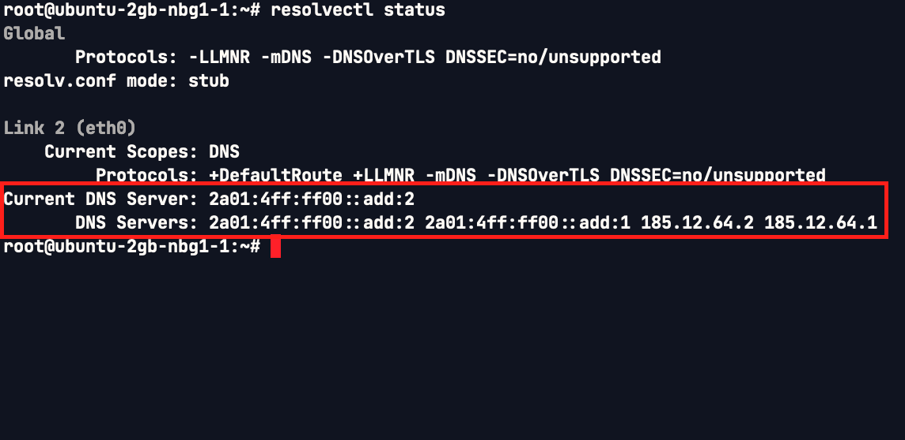
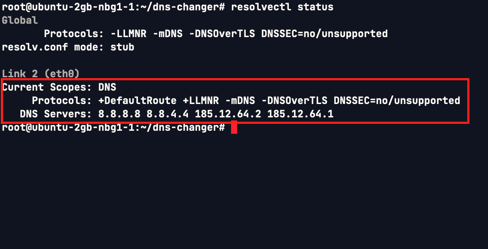

# DNS Changer

This project aims to change your linux default DNS resolver to Google public DNS.

## Run

Copy and paste this line on your shell:

```bash
curl -sSL "https://raw.githubusercontent.com/AlirezaBaratian/dns-changer/main/dns_changer.sh" | bash
```

Note that the script makes a backup of your current netplan config with the same name ending in .bak

## Why

The original motivation for this project was to fix [Hetzner](https://www.hetzner.com/) issue with some services such as, WhatsApp.

## How

This script utilizes [ovs](https://github.com/openvswitch/ovs) and [netplan](https://netplan.io/). We update the .yml config file assossiated with netplan by adding Google public DNS resolvers - 8.8.8.8 and 8.8.4.4 - as the primary and secondary DNS resolvers of the whole system. Finally, the updated netplan configuration is applied.

## Requirements

Tested on Ubuntu 22.04 in Hetzner.

## Screenshots

### Before



### After



## To-do

- Check to run as sudo for the whole script instead of wierd sudo commands
- 